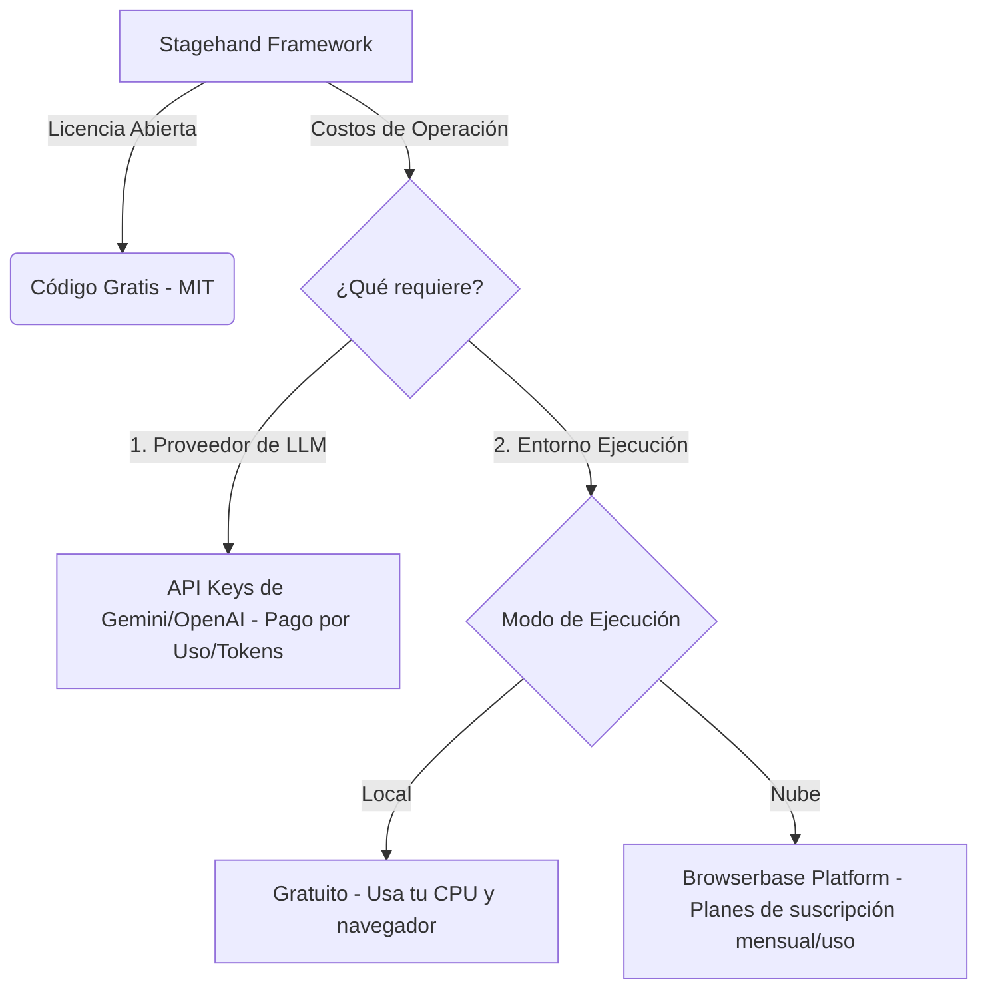

# Guía Técnica y Documentación de Stagehand

## 1. Definición o Finalidad de la Herramienta

**Stagehand** es un framework de automatización web de nivel superior y de código abierto desarrollado por **Browserbase**. Se ejecuta sobre **Playwright** y está diseñado para permitir a los desarrolladores controlar navegadores web utilizando **lenguaje natural e Inteligencia Artificial (LLMs)**.

### Finalidad Principal
La finalidad de Stagehand es resolver la **fragilidad** inherente de la automatización tradicional. En lugar de depender de selectores CSS, rutas XPath o IDs específicos del DOM (que cambian constantemente con cada rediseño de un sitio web), Stagehand utiliza un modelo de lenguaje (como Google Gemini o OpenAI GPT) para:
*   Interpretar instrucciones humanas en texto plano (ej. *"Haz clic en el botón de agregar al carrito"*).
*   Analizar semánticamente el DOM actual del navegador.
*   Ejecutar la acción correspondiente de forma precisa e inteligente.
*   Extraer información de manera estructurada validándola mediante esquemas definidos en código.

---

## 2. Características Principales

*   **Enfoque Híbrido (Playwright + IA):** Stagehand no reemplaza a Playwright, sino que lo complementa. Ofrece acceso directo al contexto del navegador y a las páginas de Playwright, permitiendo mezclar automatización determinista clásica con acciones de IA semántica.
*   **Primitivas de IA Clave:**
    *   `act()`: Realiza acciones interactivas basadas en texto natural.
    *   `extract()`: Extrae datos estructurados de cualquier página web usando esquemas de **Zod**.
    *   `observe()`: Inspecciona e identifica elementos interactivos sin interactuar directamente con ellos.
*   **Agente Autónomo Integrado:** A través de `stagehand.agent()`, puede planificar y ejecutar de manera autónoma flujos complejos de múltiples pasos para alcanzar un objetivo general de alto nivel.
*   **Compatibilidad Multi-Modelo:** Se integra nativamente con la SDK de IA de Vercel y soporta múltiples proveedores de LLM, tales como **Google Gemini** (Gemini 2.5 Flash/Pro, Gemini 3.5 Flash), **OpenAI** (GPT-4o, GPT-4o-mini) y **Anthropic**.
*   **Ejecución Local y en la Nube:** Puede correr de forma puramente local en el navegador del usuario (`LOCAL`) o en la nube mediante la infraestructura de navegadores seguros de **Browserbase**, ideal para evasión de bloqueos de bots.
*   **Mecanismo de Caché de Acciones:** Guarda en caché las decisiones de la IA para instrucciones y estructuras HTML idénticas, lo que reduce drásticamente el consumo de tokens y acelera los tiempos de ejecución posteriores.

---

## 3. Curva de Aprendizaje

La curva de aprendizaje de Stagehand se clasifica como **Baja a Moderada**, dependiendo de la experiencia previa del desarrollador:

| Perfil del Desarrollador | Facilidad de Adaptación | Conceptos Clave a Aprender |
| :--- | :--- | :--- |
| **Familiarizado con Playwright/Puppeteer** | **Muy Alta (Pocas horas)** | Integración de las primitivas de IA (`act`, `extract`), uso de Zod para validación y configuración del archivo de entorno `.env`. |
| **Desarrollador JS/TS sin experiencia en automatización** | **Alta (1 - 2 días)** | Conceptos básicos de la API de Playwright (páginas, navegación, esperas), asincronía en Node.js e integración con LLMs. |
| **Principiantes absolutos en programación** | **Moderada (1 semana)** | Fundamentos de JavaScript (ESM, Promesas), sintaxis de esquemas Zod y configuración de claves API. |

### Factores que reducen la curva de aprendizaje:
1.  **Eliminación de Selectores CSS:** Los desarrolladores ya no pasan horas inspeccionando el HTML para encontrar selectores XPath o CSS únicos.
2.  **API Minimalista:** La API de Stagehand se reduce a muy pocas funciones esenciales (`init`, `act`, `extract`, `observe`, `agent`, `close`).
3.  **Depuración Visual:** Al poder utilizarse localmente con navegadores visibles, es muy fácil auditar las acciones que realiza el modelo en tiempo real.

---

## 4. Licencia y Costos

Stagehand adopta un modelo open-source, pero su funcionamiento práctico depende de servicios externos que pueden generar costos.



### Detalle de Costos:

1.  **Framework (SDK):** **Gratuito**. Licenciado bajo la **Licencia MIT**, lo que permite su uso comercial, modificación y distribución sin costo alguno.
2.  **Costos del LLM (API de Inteligencia Artificial):** **Pago por consumo (Tokens)**.
    *   Al usar modelos como `google/gemini-3.5-flash` o `google/gemini-2.5-pro` (a través de Google AI Studio) o modelos de OpenAI, los costos dependerán del volumen de texto enviado a la IA (el DOM de las páginas web puede ser muy grande, por lo que es un factor relevante a controlar mediante optimizaciones y caché).
3.  **Costos de Infraestructura de Navegador:**
    *   **Ejecución Local (`LOCAL`):** **Gratuito**. Utiliza Chromium/Playwright integrado en tu máquina local.
    *   **Ejecución en Nube (`BROWSERBASE`):** **Pago**. Si decides utilizar el servicio en la nube de Browserbase para ejecutar navegadores persistentes, evadir CAPTCHAs, usar proxies residenciales o paralelizar la carga, se requiere una suscripción a sus planes (ej. Developer o Startup con cobro por minuto de uso).

---

## 5. Tabla de Ventajas y Desventajas de Stagehand

Frente a alternativas tradicionales y otras herramientas de IA en el mercado, Stagehand destaca por su enfoque híbrido y pragmático, aunque también presenta ciertas limitaciones técnicas e infraestructurales que se deben considerar.

### 5.1. Comparación General: Ventajas vs. Desventajas de Stagehand

| Categoría | Ventajas (Pros) | Desventajas o Limitaciones (Cons) |
| :--- | :--- | :--- |
| **Mantenimiento y Estabilidad** | **Auto-reparación (Self-healing):** No depende de selectores CSS/XPath rígidos. Se adapta automáticamente a rediseños de la interfaz interpretando semánticamente las instrucciones en texto plano. | **Riesgo de No Determinismo:** Debido a la naturaleza probabilística de los LLMs, existe una probabilidad residual de fallos imprevistos o cambios de comportamiento ("alucinaciones semánticas") en ejecuciones consecutivas. |
| **Velocidad y Latencia** | **Acceso Nativo Veloz:** Permite utilizar llamadas tradicionales de Playwright (súper rápidas y sin coste de tokens) para el 90% del flujo estructurado, activando la IA sólo en elementos específicos. | **Mayor Latencia en Acciones de IA:** Cada llamada a `act()`, `extract()` u `observe()` requiere invocar la API del LLM, lo que añade de 2 a 5 segundos de procesamiento por acción, ralentizando la ejecución general. |
| **Facilidad de Desarrollo** | **Curva de Aprendizaje Muy Baja:** Interacción directa en lenguaje natural. Evita tener que inspeccionar manualmente el DOM para encontrar IDs, nombres de clases o estructuras jerárquicas complejas. | **Complejidad de Depuración:** Rastrear por qué la IA falló al identificar un elemento puede ser difícil y requiere analizar los logs internos detallados (`verbose: 2`) y capturas de pantalla de evidencias. |
| **Costos Económicos** | **SDK Gratuita e Independiente:** El framework es open-source bajo licencia MIT, lo que elimina costos de licenciamiento de software. | **Costo de Tokens de LLM:** Analizar el DOM de páginas web grandes consume una cantidad significativa de tokens de entrada. En ejecuciones masivas, los costos de la API del LLM pueden incrementarse. |
| **Extracción de Datos** | **Estructuración y Validación Inmediata:** Extrae información compleja directamente formateada y tipada a objetos JSON válidos utilizando esquemas de **Zod**, sin post-procesamiento. | **Límite de Ventana de Contexto:** Sitios web con un DOM excesivamente grande, tablas infinitas o miles de elementos pueden superar el límite de contexto del modelo, requiriendo segmentación manual. |
| **Evasión de Bloqueos (Anti-bot)** | **Interacción Humana Simulada:** Imita de forma natural movimientos, esperas e interacciones semánticas, dificultando la detección automatizada básica. | **No resuelve Captchas por sí solo:** Corriendo de manera `LOCAL`, requiere soluciones de terceros o proxies avanzados (como Browserbase Cloud) para sortear protecciones tipo Cloudflare o CAPTCHAs complejos. |

### 5.2. Comparación frente a otras herramientas del mercado

| Característica / Herramienta | **Playwright / Selenium** | **Stagehand** | **Agentes Visuales Puros (ej. Skyvern)** |
| :--- | :--- | :--- | :--- |
| **Estabilidad del Selector** | Muy baja (se rompe si cambia el código HTML) | **Alta** (se repara usando semántica de IA) | **Muy Alta** (se adapta a cambios puramente visuales) |
| **Costo por ejecución** | Nulo (ejecución puramente local) | **Bajo - Medio** (solo pagas tokens en llamadas de IA) | **Alto** (reprocesamiento constante de imágenes y capturas) |
| **Velocidad de interacción** | Milisegundos (Inmediato) | **Segundos** (Latencia del LLM en llamadas de IA) | **Lenta** (Segundos altos por ciclo de razonamiento del agente) |
| **Control del desarrollador** | Total sobre el código y flujo | **Híbrido** (Acceso directo a Playwright + abstracciones de IA) | Bajo (El agente autónomo controla todo el ciclo de ejecución) |
| **Facilidad de Scrapeo** | Requiere selectores y mapeo manual | **Mapeo automático con esquema Zod** | Extracción automatizada interpretada |

---

## 6. Información Adicional Relevante y Arquitectura de la Herramienta

Para comprender a fondo Stagehand, es fundamental conocer cómo opera bajo el capó y cómo optimizar su implementación.

### 6.1. Arquitectura Interna de Procesamiento del DOM
Cuando ejecutas una función de IA como `act()` o `extract()`, Stagehand realiza un proceso de optimización del DOM llamado **DOM Shrinking**:
1.  **Captura del DOM:** Playwright extrae el árbol HTML de la página activa.
2.  **Limpieza semántica:** Stagehand remueve elementos innecesarios para el modelo (scripts de analíticas, estilos CSS en línea, metadatos pesados).
3.  **Anotación de elementos:** Asigna identificadores numéricos temporales (`data-stagehand-id`) a todos los elementos interactivos visibles.
4.  **Envío al LLM:** Envía esta estructura compacta junto con tu instrucción al LLM, reduciendo el consumo de tokens de entrada hasta en un **80%** en comparación con el HTML crudo.
5.  **Ejecución:** El LLM responde con el ID numérico del elemento sobre el que debe actuar, y Stagehand ejecuta la acción de forma nativa a través de Playwright.

### 6.2. Criterios de Selección de Modelos de IA (LLMs)

Stagehand permite configurar el modelo de lenguaje de acuerdo al costo y la dificultad de la tarea:

*   **Modelos Ligeros (`google/gemini-3.5-flash`, `openai/gpt-4o-mini`):**
    *   *Casos de uso:* Automatizaciones estructuradas sencillas, páginas de prueba o scraping de sitios limpios (ej. el flujo de [Demostracion.mjs](file:///c:/Users/User/Downloads/StageHand/StageHand/Demostracion.mjs)).
    *   *Ventajas:* Alta velocidad de respuesta y costos mínimos de tokens.
*   **Modelos Avanzados (`google/gemini-2.5-pro`, `openai/gpt-4o`):**
    *   *Casos de uso:* Evasión de diálogos molestos, extracción de datos extremadamente desestructurados en e-commerce reales, o resolución de workflows con navegación autónoma (ej. el scraper en [amazon.mjs](file:///c:/Users/User/Downloads/StageHand/StageHand/amazon.mjs)).
    *   *Ventajas:* Mayor razonamiento lógico, mayor tolerancia a variaciones en la interfaz y mejor apego a esquemas Zod complejos.

### 6.3. Optimización mediante el Mecanismo de Caché (Action Caching)
Para producción, Stagehand incluye una funcionalidad crítica llamada **Caché de Acciones**. Puedes activarla en la configuración inicial:

```javascript
const stagehand = new Stagehand({
  env: "LOCAL",
  model: "google/gemini-3.5-flash",
  useCache: true // Activa el almacenamiento en caché de interacciones de IA
});
```

*   **¿Cómo funciona?** Stagehand calcula un hash de la estructura del DOM visible y de la instrucción enviada. Si vuelves a correr el script en la misma página y con la misma orden, utiliza el selector guardado en caché en lugar de llamar nuevamente al LLM.
*   **Impacto:** Reduce el coste de la API de IA a **$0** para ejecuciones consecutivas idénticas y baja el tiempo de interacción a milisegundos (igual al de Playwright clásico).

### 6.4. Ciclo de Vida del Desarrollo al Despliegue en Producción
Para implementar proyectos basados en Stagehand de manera profesional, se recomienda seguir este flujo:

1.  **Fase 1: Desarrollo Local (Entorno `LOCAL` + Modelo Flash):** Permite escribir tus scripts en local, viendo el navegador abierto para auditar el comportamiento. El uso de modelos Flash minimiza los costos iniciales.
2.  **Fase 2: Robustez y Manejo de Errores:** Envolver siempre las llamadas de IA en bloques `try/catch` para manejar fallas del LLM o cambios de página abruptos, y utilizar capturas de pantalla automáticas (`page.screenshot()`) para guardar evidencias en caso de fallos.
3.  **Fase 3: Escalabilidad (Entorno `BROWSERBASE`):** Al migrar a servidores de producción, cambia `env: "LOCAL"` a `env: "BROWSERBASE"`. Esto enruta el script a navegadores alojados en la nube con IP residenciales, evitando que tus servidores locales sean baneados por CAPTCHAs u otras restricciones de bot.

---


## 7. Explicación Detallada de la Herramienta (API y Uso)

Para utilizar Stagehand en un proyecto, primero se debe configurar el entorno y luego instanciar la clase principal.

### 7.1. Configuración de Entorno e Inicialización
Se debe crear un archivo [.env](file:///c:/Users/User/Downloads/StageHand/StageHand/.env) en la raíz del proyecto para definir la clave de API del LLM:

```env
GOOGLE_GENERATIVE_AI_API_KEY=tu_clave_de_google_gemini_aqui
```

Luego, se importa e instancia la clase principal en un archivo JavaScript (con soporte ESM como `.mjs`):

```javascript
import "dotenv/config";
import { Stagehand } from "@browserbasehq/stagehand";

const stagehand = new Stagehand({
  env: "LOCAL",                        // "LOCAL" para navegador local o "BROWSERBASE" para la nube
  model: "google/gemini-3.5-flash",   // Modelo de LLM que procesará las instrucciones
  verbose: 1,                          // Nivel de logging (0 a 2)
  timeout: 30000                       // Tiempo máximo de espera para las operaciones (ms)
});

await stagehand.init();
```

---

### 7.2. Interoperabilidad con Playwright
Una de las mayores fortalezas de Stagehand es que provee acceso directo al objeto `page` de Playwright. Esto te permite navegar de forma estándar y rápida, y usar Stagehand sólo cuando sea necesario:

```javascript
// Obtener la página web inicializada por Stagehand
const page = stagehand.context.pages()[0];

// Navegación nativa de Playwright (Ultra rápida, no consume tokens de IA)
await page.goto("https://books.toscrape.com/");

// Uso de locators nativos de Playwright para aserciones de QA
const cartElement = page.locator("text=basket");
await cartElement.waitFor({ state: "visible", timeout: 5000 });
const itemsCount = await cartElement.textContent();
```

---

### 7.3. Las Tres Primitivas Fundamentales de IA

#### A. Método `act()` (Acciones Inteligentes)
Permite enviar una instrucción en lenguaje natural para realizar una acción física en la web. El LLM interpretará la acción, ubicará el elemento en el DOM y lo presionará, escribirá o scrolleará según corresponda.

```javascript
// Clic simple basado en significado
await stagehand.act("Haz clic en el enlace de la categoría 'Science'");

// Combinación de acciones complejas
await stagehand.act("Scrollea hasta que encuentres la lista de libros y haz clic en el botón 'Add to basket' del segundo libro");

// Escribir en un buscador dinámico
await stagehand.act("Escribe 'laptop gaming' en la barra de búsqueda y presiona Enter");
```

#### B. Método `extract()` (Extracción Estructurada con Zod)
Permite pasar una instrucción de extracción junto con un esquema **Zod** para definir la forma de los datos esperados. Stagehand parsea el contenido de la página, extrae la información relevante y la devuelve en un objeto tipado.

```javascript
import { z } from "zod";

// 1. Definir el esquema de salida esperado
const esquemaLibros = z.object({
  productos: z.array(
    z.object({
      titulo: z.string(),
      precio: z.string(),
      enStock: z.boolean(),
    })
  )
});

// 2. Extraer datos con IA aplicando el esquema
const datosExtraidos = await stagehand.extract(
  "Extrae el título y el precio de los primeros 3 libros visibles en la grilla",
  esquemaLibros
);

console.log(datosExtraidos.productos[0].titulo); // Acceso directo y tipado
```

#### C. Método `observe()` (Observación Semántica)
Inspecciona la página buscando posibles acciones basadas en una descripción. Retorna un arreglo de elementos que coinciden con la descripción, proporcionando detalles semánticos y técnicos sobre cómo interactuar con ellos.

```javascript
const observaciones = await stagehand.observe(
  "Encuentra los enlaces a las diferentes categorías de libros"
);

// Ejemplo de retorno: [{ selector: "...", description: "Category Science Link" }, ...]
console.log(`Se detectaron ${observaciones.length} categorías interactuables.`);
```

---

### 7.4. El Agente Autónomo (`agent`)
Cuando el flujo no es lineal o requiere toma de decisiones complejas, se puede delegar la lógica al Agente Autónomo. En lugar de codificar paso a paso las instrucciones, el agente creará su propio plan de acción y se detendrá cuando determine que se ha cumplido el objetivo final.

```javascript
// Obtener la interfaz de agente autónomo
const agent = stagehand.agent();

// Delegar la navegación autónoma para buscar una categoría
await agent.execute(
  "Navigate to the 'Poetry' category"
);

// El agente buscará de forma autónoma el enlace, navegará, manejará subpáginas
// y verificará por sí mismo si la URL o el contenido actual cumple el objetivo.
```

---

### 7.5. Buenas Prácticas y Estrategias contra Bloqueos

Al analizar los scripts del proyecto (como el scraper de [amazon.mjs](file:///c:/Users/User/Downloads/StageHand/StageHand/amazon.mjs)), se identifican las siguientes estrategias clave:

1.  **Pausas Estratégicas (`delay`):** Sitios de alta seguridad como Amazon detectan comportamientos robóticos si las acciones ocurren en milisegundos. Añadir pausas (`await delay(5000)`) ayuda a humanizar el comportamiento de la navegación.
2.  **Manejo de Popups Dinámicos:** Utilizar `act()` al inicio del flujo para limpiar la pantalla de alertas imprevistas que puedan obstaculizar la vista:
    ```javascript
    await stagehand.act(
      "si te aparece algun aviso o algun cuadro de dialogo que no tenga relacion con el sitio ciérralo"
    );
    ```
3.  **Modelos Avanzados para Entornos Complejos:** Modelos más pequeños como `gemini-3.5-flash` son excelentes para sitios estándar de prueba debido a su velocidad y bajo costo. Sin embargo, para sitios complejos con estructuras de DOM densas o protecciones antibot, se recomienda cambiar a modelos con mayor razonamiento como `gemini-2.5-pro`.
4.  **Uso de la Infraestructura en la Nube (`BROWSERBASE`):** Si la ejecución local sigue fallando por CAPTCHAs o bloqueos de IP, cambiar el entorno de inicialización a `"BROWSERBASE"` permite que el script corra detrás de proxies residenciales avanzados y huellas dactilares de navegador reales.
